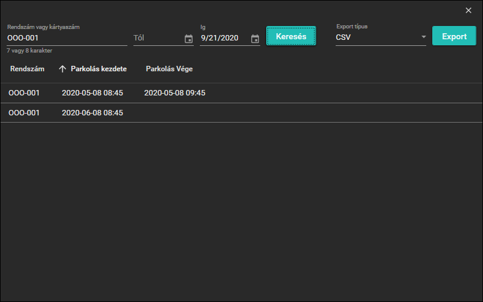

# Feladat
Egy .NET Core 3.1 WPF-es demo alkalmazás az alábbiak bemutatására:
* Az architektúra a [eShopOnWeb](https://github.com/dotnet-architecture/eShopOnWeb)-ban bemutatott [Clean architecture](https://docs.microsoft.com/en-gb/dotnet/architecture/modern-web-apps-azure/common-web-application-architectures#clean-architecture) alapján készült
* EF Core
* Code First migration
* Repository pattern
* MVVM pattern
* [Code snippet](https://docs.microsoft.com/en-us/visualstudio/ide/walkthrough-creating-a-code-snippet?view=vs-2019#import-a-code-snippet) Snippets\wpropf.snippet
* [Generic host](https://docs.microsoft.com/en-us/aspnet/core/fundamentals/host/generic-host?view=aspnetcore-3.1) használata WPF-ben
* Dependeny injection
* Material Design használata
* Dark theme-hez illeszkedően, a beépített fejléc eltüntése és saját ablakkezelő gombok
* DataGrid kibővítése, attribútumból történő oszlop név és default rendezés megadására
* ```NotEmptyValidationRule``` a bevitelimezők validálására
* ```BindingErrorListener``` a bindolási hibák megjelenítésére a consoleban
* Többszörös ```IExporter``` implementációnak megfelelően megjelenő Exporter legördülő

# Tesztadatok
Teszteléshez 
Rendszámok:
* OOO-001
* OOO-002
Pakolókártyaszám:
* 00000001

# Development
- ```appsettings.json```-ben található ```ApplicationDbContext```-ben megkell adni egy MSSQL connectionstringet, defaultból [localdb](https://docs.microsoft.com/en-us/sql/database-engine/configure-windows/sql-server-express-localdb?view=sql-server-ver15)-t használ
A solution gyökérben: 
- dotnet tool restore
- dotnet ef migrations add Init --context AppIdentityDbContext --startup-project .\src\Web --project .\src\Infrastructure\ --output-dir Identity\Migrations
- dotnet ef migrations add Init --context Forma1Context --startup-project .\src\Web --project .\src\Infrastructure\ --output-dir Data\Migrations

# Képek az alkalmazásról
